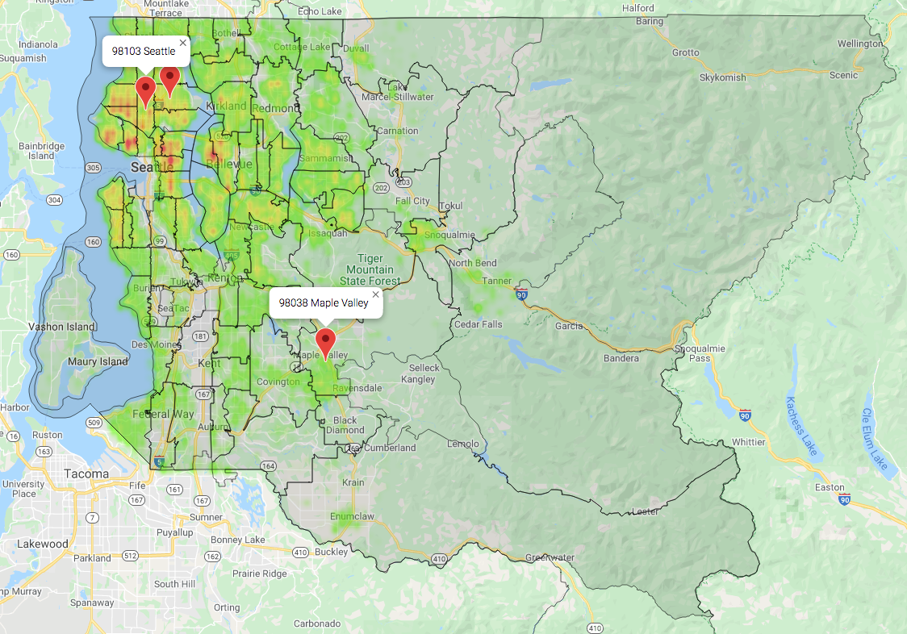
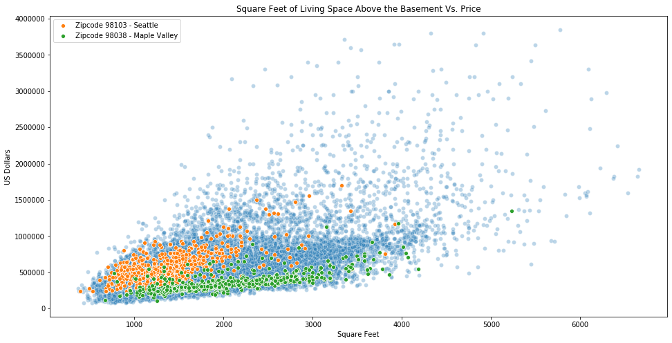

# The Keys to Your New House

## A multivariate linear regression analysis of the King County Housing Dataset

### Author: Michael Erb

The contents of this repository detail an analysis of the King County Housing Dataset and a Multivariate Linear Regression Analysis of that dataset to predict the sale price.

## Business problem:

TheKeys will be a web based service that helps individuals or families moving to a new area under the premise of being recruited to work for a mid to large size corporation, as well as help those same corporations stay well informed of the housing market of their perspective and current employees to help them with offering adequate compensation to those employees given the housing options available.

The first beta for this service will be for King County, WA, which is home to many large corporations including Amazon, Starbucks, and Microsoft, plus many mid sized corporations that can be reviewed [here.](https://en.wikipedia.org/wiki/List_of_companies_based_in_Seattle).

## Data

The King County Housing Dataset, available [here.](https://github.com/learn-co-students/dsc-mod-2-project-v2-1-onl01-dtsc-pt-012120/blob/master/kc_house_data.csv)

It includes details about each house including sqft, bedrooms and bathrooms, age of the house, location of the house by zip code and latitude/longitude and the sale price and date.  The dataset has a date range of May 2nd, 2014 through May 27th, 2015.

## Methods

* Exploratory Data Analysis of the dataset to understand each data feature and their relationship among each other and to the target, the housing sale price.
* Iterative improvements to linear regression models, by adding additional features, interactions, polynomials and choosing which features to keep in the models using stepwise selection and checking for multicollinearity.

## Results

**Heat Map of Housing Activity by Gross Sales**

The housing sales activity is concentrated in the western side of the county, and the greatest concentration of high value housing is in Seattle.  The first and third most active zip codes in the county are parts of Seattle and are indicated by the red markers in the upper left hand corner. The most active zip code outside of Seattle is Maple Valley which generally has lower priced housing than Seattle.

The positive correlation  between the sqft of living space above the basement of a house and the house's selling price.  The two most active zip codes in terms of house sales are indicated in orange and green, with orange being part of Seattle and green being Maple Valley, a less expensive area of the county.

In certain situations the addition of a bedroom actually lowers the price of a house, while, for realistic houses, adding a bathroom always increases the price.

A multivariate regression model for predicting housing prices was created with an R-Squared value of 0.83.

## Recommendations

Use the current model to predict price ranges by zip code so that home buyers can see what their macro options are for housing location and price.  They could then combine this knowledge with commute time when looking for a housing location.  The model can also provide general price modifications to a house such as knowing how much an additional bedroom or bathroom would cost, and how the price changes depending on the addition or subtraction of square footage.

## Limitations & Next Steps

The accuracy of the linear regression models is not sufficient for launching the business, but they are a step in the right direction.  An expert could do a better job making predictions, but of course not at the scale and speed of our models.

To make improvements to our model, we need additional data.  To start, better location information, specifically neighborhood level data, historical price information for each house and real time localized information about the housing market.

### For Further Information

Please review the narrative of the analysis in the [Jupyter notebooks](index.ipynb), review the [presentation](theKeys.pdf), or read the related [blog article](https://medium.com/analytics-vidhya/waiting-for-the-bathroom-a-linear-regression-story-8b2b7c48bcc7).
